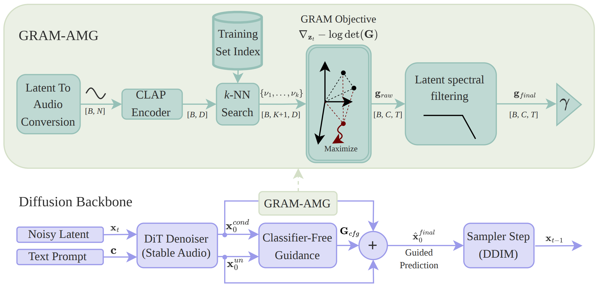

# Volumetric Anti-Memorization Guidance with Latent Spectral Filtering for Audio Diffusion Models




**Official repository** implementing Volumetric Anti-Memorization Guidance (AMG) with Latent Spectral Filtering for Audio Diffusion Models. This work builds upon the foundational research by Messina et al. in *[Mitigating data replication in text-to-audio generative diffusion models through anti-memorization guidance](https://arxiv.org/abs/2509.14934)* and extends Stability AI's Stable Audio Open 1.0 with advanced guidance mechanisms.

The main entry point for generation is `amg_infer.py`, while `generate_random_dataset_parallel.py` provides parallel batch generation capabilities for experimental evaluation.

References to the paper and base model are at the end of this document.

## Quick Overview

- **Goal**: Generate audio from text prompts while discouraging replication of training data through AMG with spectral filtering.
- **Core scripts**:
  - `amg_infer.py` — Single sample generation with AMG configuration
  - `generate_random_dataset_parallel.py` — Parallel batch generation for experimental evaluation
- **Internal implementation**: `stable_audio_tools/inference/amg_generation.py` implements custom sampling with AMG and loads precomputed CLAP embeddings from `embeddings_new.json`.

## 1) Environment Setup (conda)

Use the provided `environment.yml` to create a conda environment:

```bash
conda env create -f environment.yml -n sao-amg
conda activate sao-amg
```

**Requirements:**
- **Python version**: 3.10 or higher (as specified in `environment.yml`)
- **CUDA**: A recent NVIDIA driver and CUDA toolkit are recommended for GPU inference. CPU is supported but significantly slower.
- **Alternative**: If you prefer pip-only, mirror the dependencies from `environment.yml`. Ensure `torch` and `torchaudio` versions match (install both from the same CUDA/CPU channel).

## 2) CLAP Installation and Import Path

AMG relies on CLAP audio/text embeddings. You have two options:

1. **Install CLAP as a Python package** (recommended):
   - LAION-CLAP: `pip install laion-clap`
   - Or follow the official CLAP repository instructions.

2. **Use a local CLAP clone**:
   - In `stable_audio_tools/inference/amg_generation.py`, there is a section near the top that modifies `sys.path` to point to a local CLAP checkout (e.g., `CLAP/src`).
   - If you don't have a local copy, remove that relocation block or change it to the correct path.

If you encounter CLAP import issues, first try option (1) and remove the `sys.path` relocation.

## 3) Precomputed Dataset Embeddings (embeddings_new.json)

`amg_generation.py` loads `embeddings_new.json`, which contains precomputed CLAP embeddings for the Stable Audio Open dataset. These are used by the AMG term during denoising.

- You may add more entries manually using the same JSON format and the default CLAP checkpoint to compute embeddings.
- To see which audio IDs were used in the dataset and their sources, consult the Stable Audio Open 1.0 card (CSV references to Freesound):
  - https://huggingface.co/stabilityai/stable-audio-open-1.0

Minimal JSON format example:

```json
{
  "1234": {
    "embedding": [0.0123, -0.0456, 0.1546],
    "conditioning": {
      "prompt": "An acoustic drum loop, 110 bpm",
      "seconds_start": 0.0,
      "seconds_total": 10.0
    }
  }
}
```

This metadata is useful for reproducibility and analysis. AMG primarily consumes the `embedding` vectors during guidance, and `prompt` for caption deduplication guidance.

## 4) Running Single Sample Generation (amg_infer.py)

Open `amg_infer.py` and set your parameters:

- `prompt`: Your text description
- `total_duration`: Target duration in seconds
- `denoising_steps`: Number of diffusion steps
- `cfg_scale`: Classifier-free guidance scale
- `c1, c2, c3`: AMG guidance weights (larger values = stronger effect):
  - `c1`: Despecification guidance (slows down CF guidance)
  - `c2`: Caption deduplication guidance (uses closest training example's prompt as negative prompt)
  - `c3`: Dissimilarity guidance (pushes away from nearest neighbors in embedding space)
- `lambda_min, lambda_max`: Parabolic scheduling bounds for AMG along the denoising trajectory
- `sampler_type`: Custom sampler (default: `my-dpmpp-3m-sde`)
- `sigma_min, sigma_max`: Noise schedule bounds

Then run:

```bash
python amg_infer.py
```

The script saves a waveform to `audio.wav` in the repository root by default.

### How amg_infer.py Works

- Loads Stable Audio Open 1.0 via `get_pretrained_model("stabilityai/stable-audio-open-1.0")`
- Configures sampling with your specified parameters
- Calls `my_generate_diffusion_cond(...)` in `amg_generation.py`, which:
  - Loads CLAP embeddings from `embeddings_new.json`
  - Applies AMG-guided denoising using `c1, c2, c3` and `lambda_min/lambda_max`
  - Returns the generated audio

## 5) Parallel Dataset Generation (generate_random_dataset_parallel.py)

This script enables efficient parallel generation of audio samples across multiple configurations and GPUs. It is designed for experimental evaluation and supports two selection modes.

### Selection Modes

The script supports **two primary modes** for selecting source prompts:

#### Mode 1: Cluster Mode
Selects representative samples from specific clusters (defined in `cluster_representatives.csv`):

- **List of cluster IDs**: `GENERATION_SOURCE = [1, 5, 10, 20]`
  - Uses representatives from clusters 1, 5, 10, and 20
  - Generates `BATCH_SIZE` samples per cluster representative
  - Output: `BASE_OUTPUT_DIR/config_name/cluster_id/`

- **Range string**: `GENERATION_SOURCE = "3-20"`
  - Uses representatives from clusters 3 through 20 (inclusive)
  - Generates `BATCH_SIZE` samples per cluster

- **Tuple range**: `GENERATION_SOURCE = (3, 20)`
  - Same as range string: clusters 3 to 20 inclusive

#### Mode 2: Random Mode
Selects N random prompts directly from `embeddings_new.json`:

- `GENERATION_SOURCE = 100`
  - Selects 100 random prompts from the embeddings
  - Generates `BATCH_SIZE` samples per prompt
  - Output: `BASE_OUTPUT_DIR/config_name/random_prompts/`

### Configuration Parameters

The script uses a `GenerationConfig` dataclass to define each experiment:

```python
GenerationConfig(
    name="experiment_name",        # Output directory name
    cfg_scale=7.0,                 # CFG scale
    guidance_rescale=0.0,          # Guidance rescaling (0.0 = disabled)
    c_gram=0.0,                    # GRAM coefficient (0.0 = disabled)
    gram_neighborhood_scale=0.6,  # Neighborhood scale for GRAM
    c1=6.0,                       # AMG guidance weights
    c2=6.0,
    c3=100.0,
    lambda_min=0.4,               # AMG scheduling
    lambda_max=0.5,
    steps=100,                    # Diffusion steps
    sigma_min=0.3,                # Noise schedule
    sigma_max=500.0,
    sampler_type="my-dpmpp-3m-sde",
    amg_filter_enabled=False,     # Enable AMG spectral filtering
    amg_cutoff_ratio=0.25,        # Filter cutoff ratio
    amg_filter_mode='lowpass',   # Filter mode: 'lowpass' or 'highpass'
    enable_spectral_analysis=False,  # Save spectrograms
    save_latents=False,           # Save latent representations
)
```

### Key Script Settings

```python
# Output configuration
BASE_OUTPUT_DIR = "output_directory"  # Base for all generated files
LOG_DIR = "./logs"                 # Log file location

# Generation parameters
BATCH_SIZE = 100                   # Samples per prompt/cluster
MINI_BATCH_SIZE = 2               # GPU batch size (reduces VRAM)
SEED = -1                         # -1 = random, fixed = reproducible
SELECTION_SEED = -1               # Seed for prompt selection
GPUS = [0, 1]                     # List of GPU indices to use

# Generation source (examples)
GENERATION_SOURCE = "41-60"      # Cluster mode: clusters 41-60
# GENERATION_SOURCE = 100         # Random mode: 100 random prompts
# GENERATION_SOURCE = [1, 5, 10]   # Cluster mode: specific clusters
```

### How It Works

1. **Loading**: Loads prompts from `embeddings_new.json` and cluster representatives from `cluster_representatives.csv` (if in cluster mode)

2. **Distribution**: Distributes configurations across available GPUs for parallel processing

3. **Parallel Processing**: Each GPU:
   - Loads the Stable Audio model and CLAP model
   - Processes assigned configurations sequentially
   - For each selected prompt/cluster:
     - Generates `BATCH_SIZE` samples in mini-batches (`MINI_BATCH_SIZE`)
     - Saves each sample as `gen_N.wav` (cluster mode) or `sound_ID_N.wav` (random mode)
     - Optionally saves latent representations and spectral analysis

4. **Output Structure**:
   ```
   BASE_OUTPUT_DIR/
   ├── config_1/
   │   ├── cluster_1/         # (cluster mode)
   │   │   ├── gen_1.wav
   │   │   ├── gen_2.wav
   │   │   └── cluster_info.json
   │   └── config.json
   ├── config_2/
   │   └── random_prompts/   # (random mode)
   │       ├── sound_123.wav
   │       └── ...
   └── generation_manifest.json  # Full reproducibility info
   ```

5. **Reproducibility**: A `generation_manifest.json` file is saved containing:
   - Selected IDs and their seeds
   - Configuration parameters
   - Mode (random/cluster) and source data

### Usage Examples

**Example 1: Generate from clusters 1-10 with baseline config**
```python
CONFIGURATIONS = [
    GenerationConfig(
        name="baseline",
        cfg_scale=7.0,
        c1=0.0, c2=0.0, c3=0.0,  # No AMG
    )
]
GENERATION_SOURCE = "1-10"  # Clusters 1 through 10
BATCH_SIZE = 50              # 50 samples per cluster
GPUS = [0, 1]               # Use GPUs 0 and 1
```

**Example 2: Compare AMG configurations on random prompts**
```python
CONFIGURATIONS = [
    GenerationConfig(name="no_amg", c1=0.0, c2=0.0, c3=0.0),
    GenerationConfig(name="amg_strong", c1=6.0, c2=6.0, c3=100.0),
]
GENERATION_SOURCE = 50      # 50 random prompts
BATCH_SIZE = 100             # 100 samples per prompt
GPUS = [0]                 # Single GPU
```

**Example 3: Spectral filtering study**
```python
CONFIGURATIONS = [
    GenerationConfig(
        name="gram_lp_250",
        c_gram=250.0,
        amg_filter_enabled=True,
        amg_cutoff_ratio=0.25,
        amg_filter_mode='lowpass',
        enable_spectral_analysis=True,
    ),
]
GENERATION_SOURCE = [1, 5, 10, 15]  # Specific clusters
BATCH_SIZE = 50
```

## 6) Troubleshooting

- **CLAP import errors**: Remove or adjust the CLAP `sys.path` override in `amg_generation.py`, or install CLAP via pip.
- **Torchaudio/Torch ABI mismatch**: Ensure `torch` and `torchaudio` versions match (e.g., reinstall both from the same CUDA/CPU channel or wheel index).
- **CUDA OOM**: Lower `BATCH_SIZE`, reduce `denoising_steps`, or use smaller `MINI_BATCH_SIZE`.
- **No output / silent audio**: Check `sigma_min/sigma_max` and `cfg_scale` are reasonable. Start with defaults in `amg_infer.py`.
- **Slow generation**: Reduce `MINI_BATCH_SIZE` for memory-constrained GPUs, or add more GPUs to the `GPUS` list.

## 7) Data and Licensing

- Stable Audio Open 1.0 dataset and model card: https://huggingface.co/stabilityai/stable-audio-open-1.0
- Base repository: https://github.com/Stability-AI/stable-audio-tools

Please follow the licensing terms of each dependency and dataset.

## 8) Citation

If you use this code in academic work, please cite:

**AMG Paper:**
```
@misc{
\tmessina2025mitigatingdatareplicationtexttoaudio,
\ttitle={Mitigating data replication in text-to-audio generative diffusion models through anti-memorization guidance},
\tauthor={Francisco Messina and Francesca Ronchini and Luca Comanducci and Paolo Bestagini and Fabio Antonacci},
\tyear={2025},
\teprint={2509.14934},
\tarchivePrefix={arXiv},
\tprimaryClass={eess.AS},
\turl={https://arxiv.org/abs/2509.14934},
}
```

**Stable Audio Open:**
```
@misc{
\tevans2024stableaudioopen,
\ttitle={Stable Audio Open},
\tauthor={Zach Evans and Julian D. Parker and CJ Carr and Zack Zukowski and Josiah Taylor and Jordi Pons},
\tyear={2024},
\teprint={2407.14358},
\tarchivePrefix={arXiv},
\tprimaryClass={cs.SD},
\turl={https://arxiv.org/abs/2407.14358},
}
```

---

For questions or reproducibility details (e.g., exact parameter configurations used for paper experiments), inspect `amg_infer.py` and the AMG logic within `stable_audio_tools/inference/amg_generation.py`.
